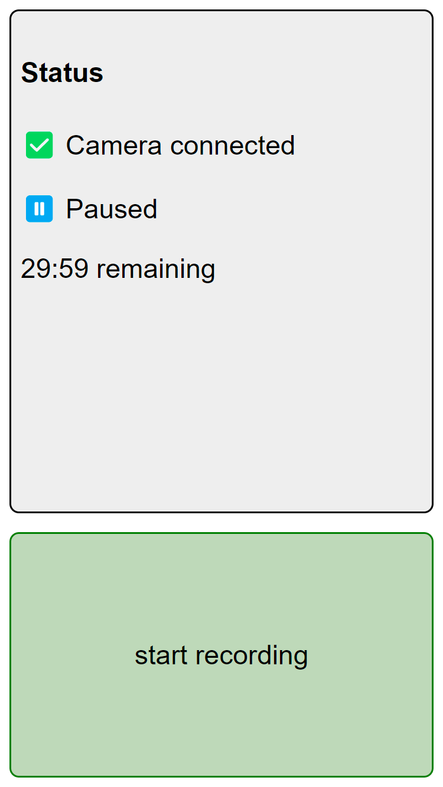

Camera Video Restart
====================

I used to use a Panasonic Lumix DLSM camera, not only for photography, but often also for video filming.
Unfortunately, the European models of this and most similar cameras are limited to a continuous recording time of 30
minutes, which may not be enough in certain circumstances (e.g. when recording concerts or theatre performances).
However, the camera can be controlled via Wi-Fi using an API that was [reverse-engineered here](https://www.personal-view.com/talks/discussion/6703/control-your-gh3-from-a-web-browser-now-with-video-/p1) and thankfully
implemented in Python by [Michael Hand](https://github.com/palmdalian/python_lumix_control).

This script uses the camera's API to automatically restart the video recording on compatible cameras automatically
once the time limit has been reached. It also allows you to start and stop the recording from your phone or laptop
using a web-based UI.

Recently, I have made the tool a bit more flexible to be able to automatically **discover multiple cameras on the 
network** and also made it compatible with certain Sony cameras, inspired by
[existing](https://github.com/petabite/libsonyapi)
[implementations](https://github.com/Bloodevil/sony_camera_api)
of the Sony Camera API.



Intended use
------------

The script is intended to be installed on a portable device, such as a Raspberry Pi or a laptop, that is connected to
the same Wi-Fi network as the camera. This network does not need to have internet access.
The most convenient way is to set up a Raspberry Pi (Zero) with integrated Wi-Fi to host its own wireless network, which
the camera can then be connected to.
How to set this up exactly depends on the Raspbian version you're using, older versions use
[`hostapd`](https://gist.github.com/lukicdarkoo/6b92d182d37d0a10400060d8344f86e4) while newer ones use
[`NetworkManager`](https://raspberrytips.com/access-point-setup-raspberry-pi/). The Pi can also be configured to run
a hotspot and connect to a different network as a client at the same time.

To run the script as a service on Linux, use the following systemd configuration, saved in
`/etc/systemd/system/camera_video_restart.service`:

```
[Unit]
Description=Runs Web UI on localhost:8000 to restart camera video recording

[Service]
User=pi
WorkingDirectory=/home/pi/camera-video-restart
ExecStart=/home/pi/camera-video-restart/video_time_webui.py
Restart=always

[Install]
WantedBy=multi-user.target
```
The web UI should then be reachable on port 8000.

Tested cameras
------------------

- Panasonic LUMIX DMC-G81
- Panasonic LUMIX DMC-GX80
- Sony ILCE-7M3 (Alpha 7 III)

Note: The Sony ILCE-7M3 cannot connect to an existing WiFi, so the Raspi needs to be connected as a client to the
camera's hotspot. 
This means that multiple Sony cameras in parallel could only be supported when using extra Wi-Fi adapters.

Open issues / possible improvements
-----------------------------------

This script was built as a single-use tool without high standards for code quality or flexibility.
I have some ideas for additional features that would be useful to add, but currently no concrete plans to work on them.
If you want to help, please feel free to send a PR!

- **Support for other camera models**: Some other cameras from the same manufacturers use the same API, so they might also work. But there may also be differences causing it to be incompatible.
- **Support for use with the camera's own hotspot** - works for Sony cameras, not tested with Panasonic
- Live view of the camera stream through the web UI, additional camera settings, etc.

